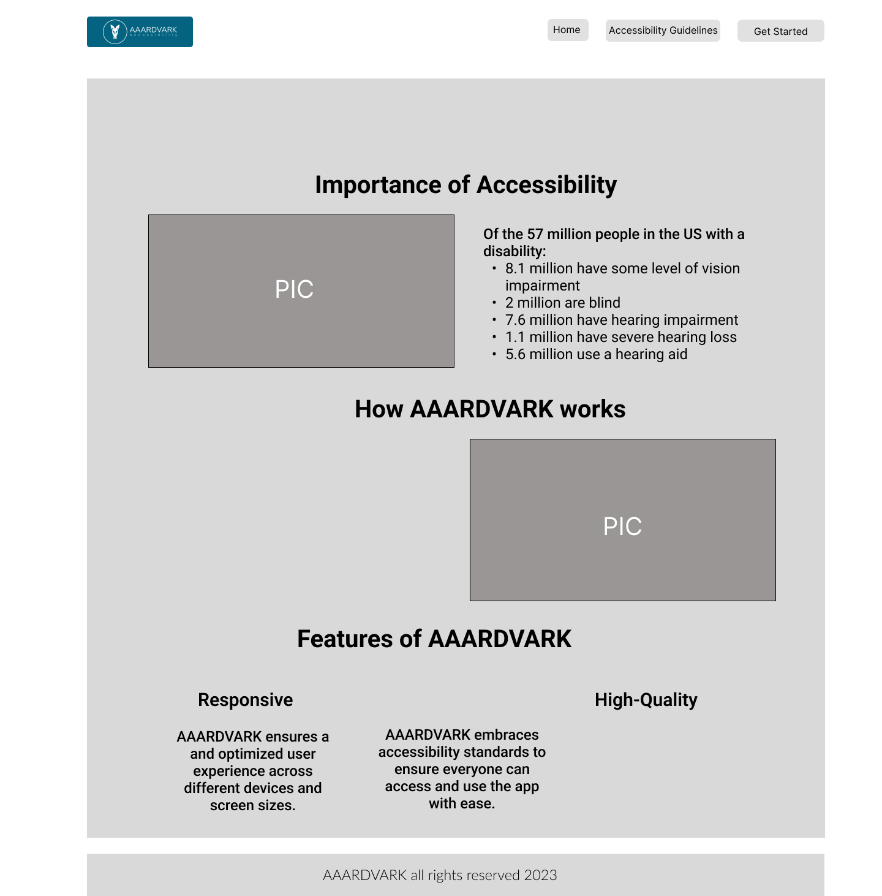
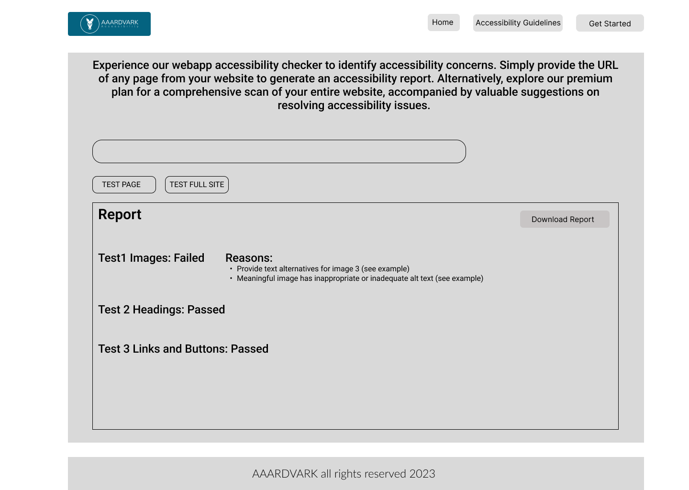
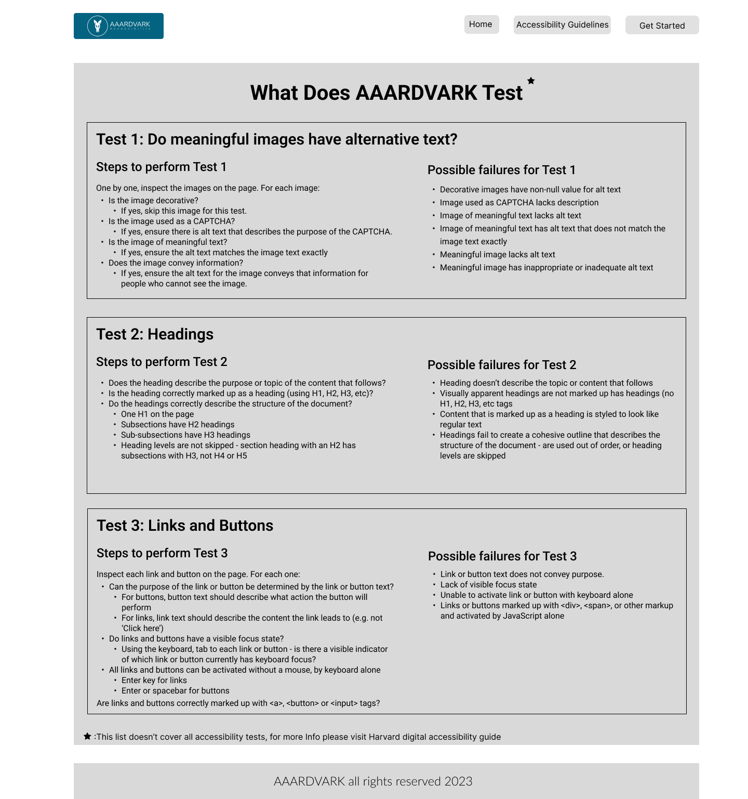
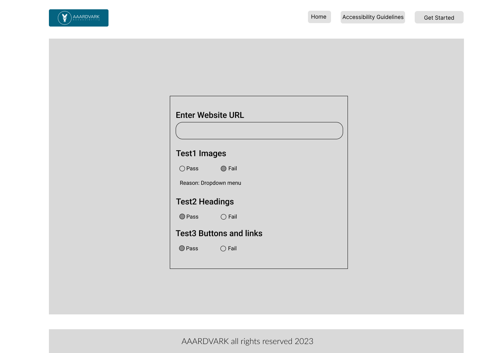

# A11yAdvisor

  

<!-- project philosophy -->

> A web app designed to help developer learn how to manually test sites for accessibility.

### User Stories

- As a developer, I want to be guided through a series of accessibility tests.

- As a developer, I want to view the results of the accessibility tests.
- As a developer, I want to log any accessibility issues I find.

- As a developer, I want to see explanations for each test and what to look for.

  

<!-- Prototyping -->

> We designed AAARDVARK using wireframes, iterating on the design until we reached the ideal layout for easy navigation and a seamless user experience.

### Wife Frames

> |     | Landing                             | Form                             |
> | --- | ----------------------------------- | -------------------------------- |
> |     |  |  |

> |     | Guide                             | Logs                             |
> | --- | --------------------------------- | -------------------------------- |
> |     |  |  |

> This is a small demo serving as a walkthrough of the app:

### Demo

> | Demo                                        |
> | ------------------------------------------- |
> |  |
